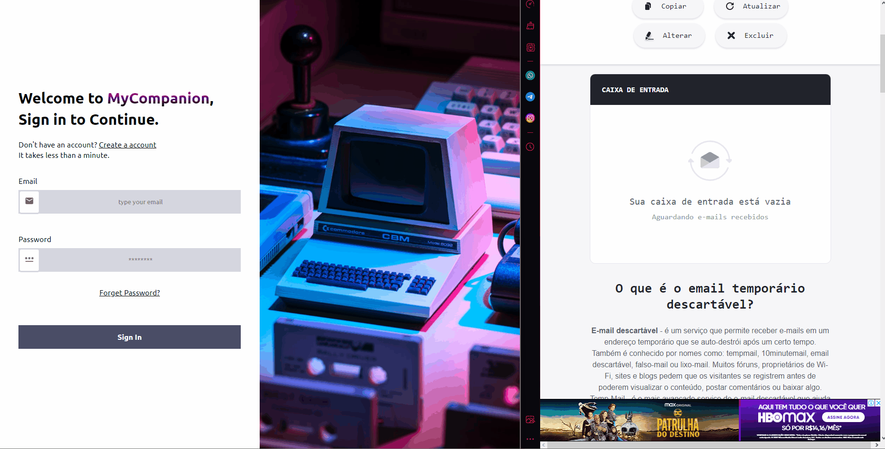

# Login Screen
A responsive login screen with validation, built in React. 

## Snapshots

### Create Account

  

### Update Info

  

### Reset Password via OTP

  

## Links

Watch it in action [here](https://login-screen-i1awe0bq3-jvictor-cc.vercel.app/)

## Features

* Create Account
* Update your account information
* Reset password via email and OTP 
* Responsive Design
* Email/Password Validation
* Display Success/Error messages
* Disabled submit button while validation fails

## Built With

* React
* Typescript
* React Router Dom
* Styled Components
* React Hook Forms / yup
* Context API
* Supabase Auth/DB
